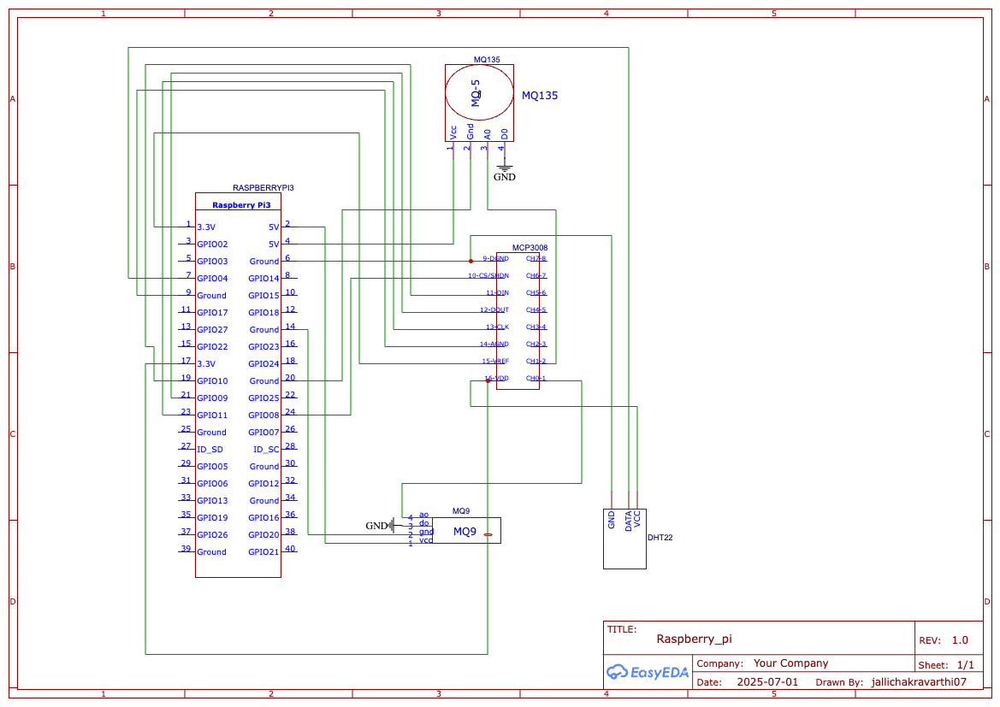

# Room Sensor Monitoring System

This is a full-stack IoT application for real-time monitoring of room environmental data using a Raspberry Pi, gas and temperature/humidity sensors, and a MERN (MongoDB, Express, React, Node.js) web application.

---

## 🚀 Features

* Real-time monitoring of:

  * Temperature
  * Humidity
  * CO, CH₄, LPG (via MQ9)
  * CO₂, NH₃ (via MQ135)
* Live dashboard with auto-refresh
* Sensor status and live/offline detection
* Email alerts on:

  * Sensor threshold breach
  * Sensor failure
* Data history:

  * View up to 14 days (for authenticated users)
  * Last 10 hours visible without login
* CSV export with selectable averaging intervals
* Authentication using JWT

---

## 🛠 Technologies Used

| Layer    | Tech Stack                           |
| -------- | ------------------------------------ |
| Frontend | React, Chart.js, CSS                 |
| Backend  | Node.js, Express, MongoDB (Mongoose) |
| Auth     | JWT (JSON Web Tokens)                |
| Alerts   | Nodemailer (Gmail SMTP)              |
| Hardware | Raspberry Pi, DHT22, MQ9, MQ135      |

---

## 🌐 Live Links

* **Frontend**: [https://your-frontend.vercel.app](https://your-frontend.vercel.app)
* **Backend API**: [https://room-stat-tracker.onrender.com](https://room-stat-tracker.onrender.com)

---

## 📁 Directory Structure

```
room_stat_tracker/  
├── backend/  
│   ├── models/  
│   ├── routes/  
│   ├── middleware/  
│   └── server.js  
├── client/  
│   └── src/  
│       ├── components/  
│       └── App.js  
└── raspberry_pi/  
    └── send_sensor_data.py  
```

---

## 🔄 How It Works

1. **Sensor Reading**
   Raspberry Pi collects temperature, humidity, and gas concentration values from connected sensors.

2. **Data Transmission**
   Sensor values are sent every 4–5 seconds via HTTP POST to the backend API.

3. **Backend Processing**
   The server stores incoming data in MongoDB and checks for threshold breaches. If conditions are met, an email alert is triggered to all users.

4. **Frontend Visualization**
   The React app polls the backend every 5 seconds for updates. If the latest data is older than 12 seconds, the dashboard shows "No Live Data".

---

## ⚠ Sensor Thresholds

| Parameter   | Condition for Alert       |
| ----------- | ------------------------- |
| Temperature | > 37°C                    |
| Humidity    | > 75% **AND** temp > 32°C |
| CO (MQ9)    | > 10                      |
| CH₄ (MQ9)   | > 5                       |
| LPG (MQ9)   | > 5                       |
| CO₂ (MQ135) | > 1000 ppm                |
| NH₃ (MQ135) | > 10 ppm                  |

---

## 📦 Raspberry Pi Setup

### 1. Connect Sensors

* DHT22 → GPIO 4
* MQ9 → MCP3008 Channel 1
* MQ135 → MCP3008 Channel 0

### 2. Install Required Python Libraries

```bash
sudo apt-get update
sudo apt-get install python3-pip
pip3 install Adafruit_DHT spidev requests
```

### 3. Enable SPI on Pi

```bash
sudo raspi-config
# Go to Interfacing Options > SPI > Enable
```

Then reboot:

```bash
sudo reboot
```

### 4. Run the Python Script

```bash
cd raspberry_pi
python3 send_sensor_data.py
```

Sensor values will now be sent to the backend every 4 seconds.

---

## 📈 CSV Export

* Users can choose average intervals like:

  * `30m`, `1h`, `6h`, `1d`, etc.
* Max interval: **14 days**
* CSV includes average temperature, humidity, and gas concentrations per interval.

---

## 🖼️ Hardware Schematic

Below is the schematic for the Raspberry Pi Room Stat Tracker setup:



---

## 🔐 Authentication

* Users must **register and log in** to:

  * Export CSVs
  * View historical data beyond 6 hours
  * Receive email alerts

---

## ✅ Future Improvements

* Graphs for individual gases
* Sensor calibration interface
* Push notifications
* Room comparison dashboard

